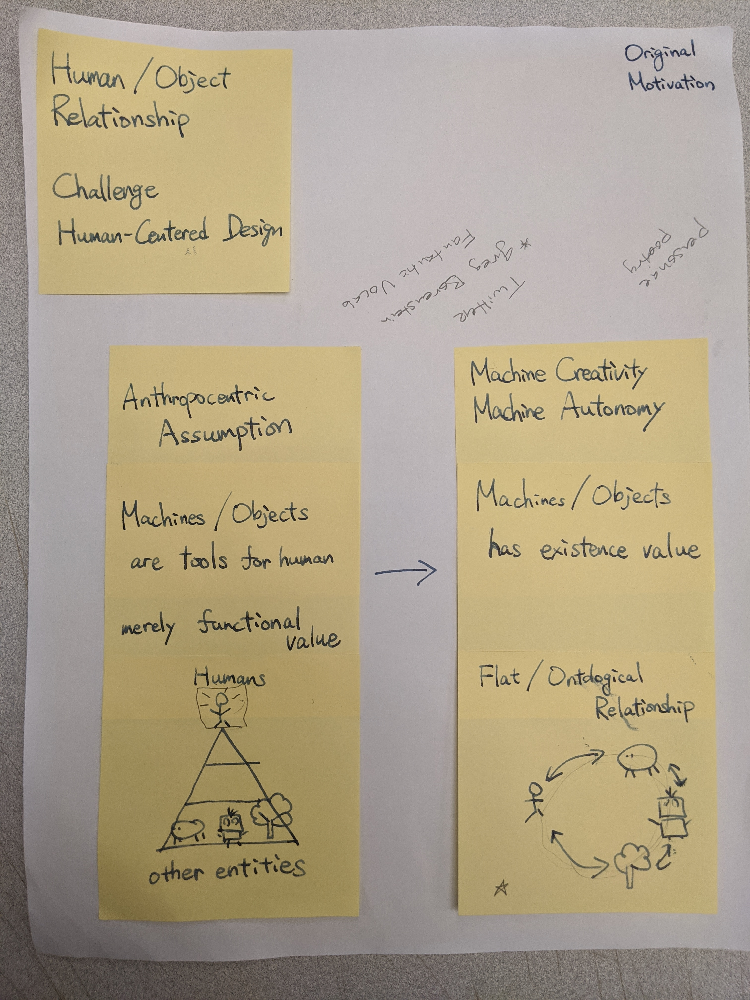
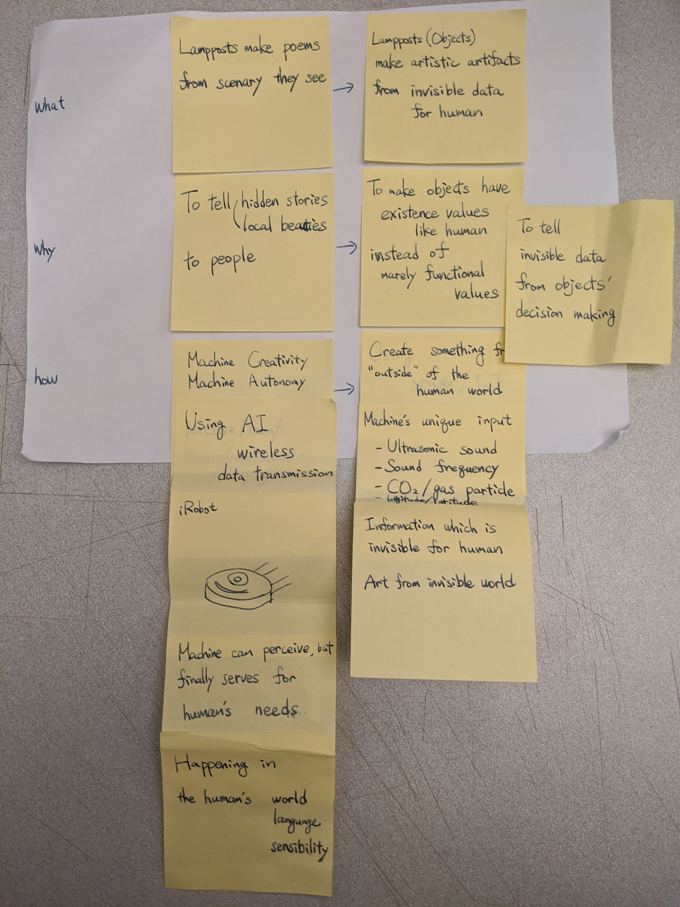
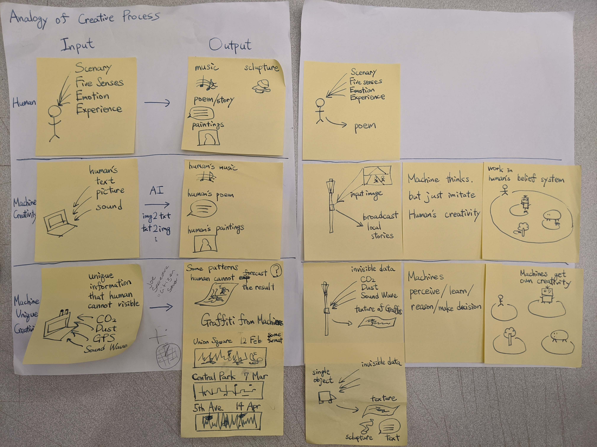
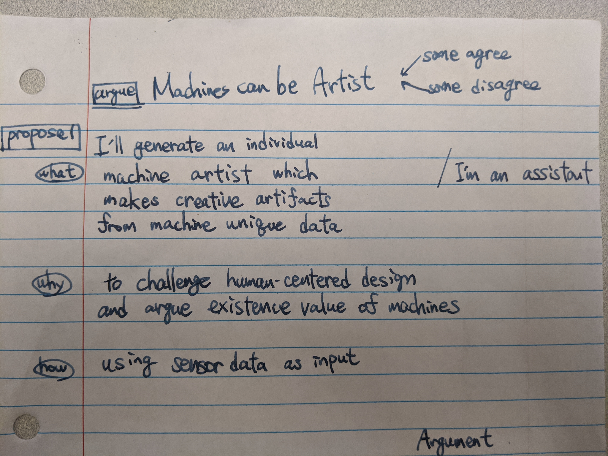
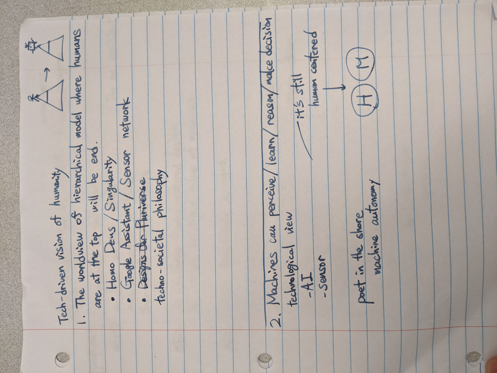
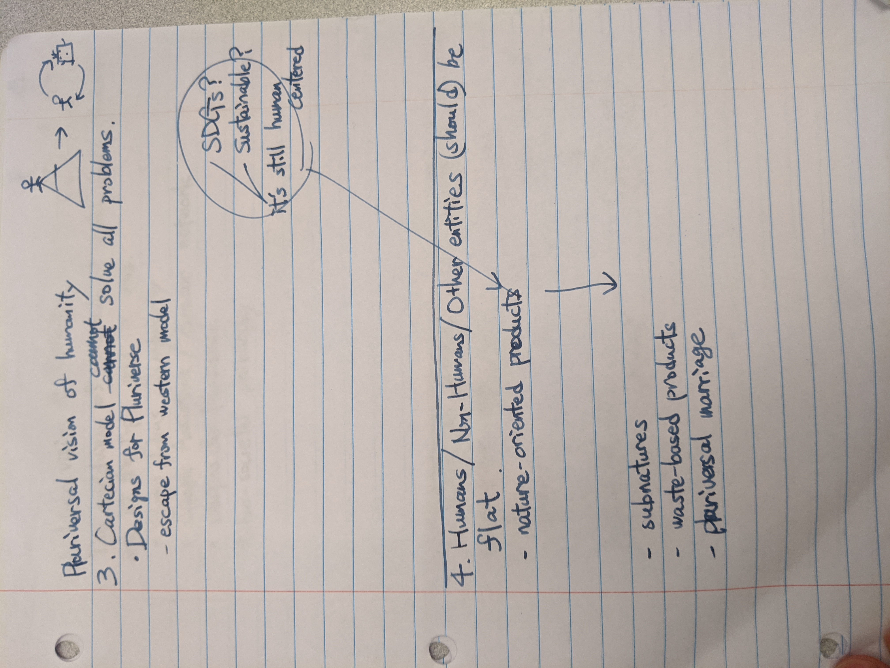

# Current Concept

## Argument
Machines can be Artists.

## Proposal
I will generate a machine individual artist which makes creative outputs from machine unique data

to challenge human centered design and argue existence values of machines.

## Intended form
Creative output of machine Artists

They will be showcased in the exhibition or/and symposium.

## What I will make

- Machine Persona
- Sample outcomes of machine artist

# Studio Feedback

# Writing Session

