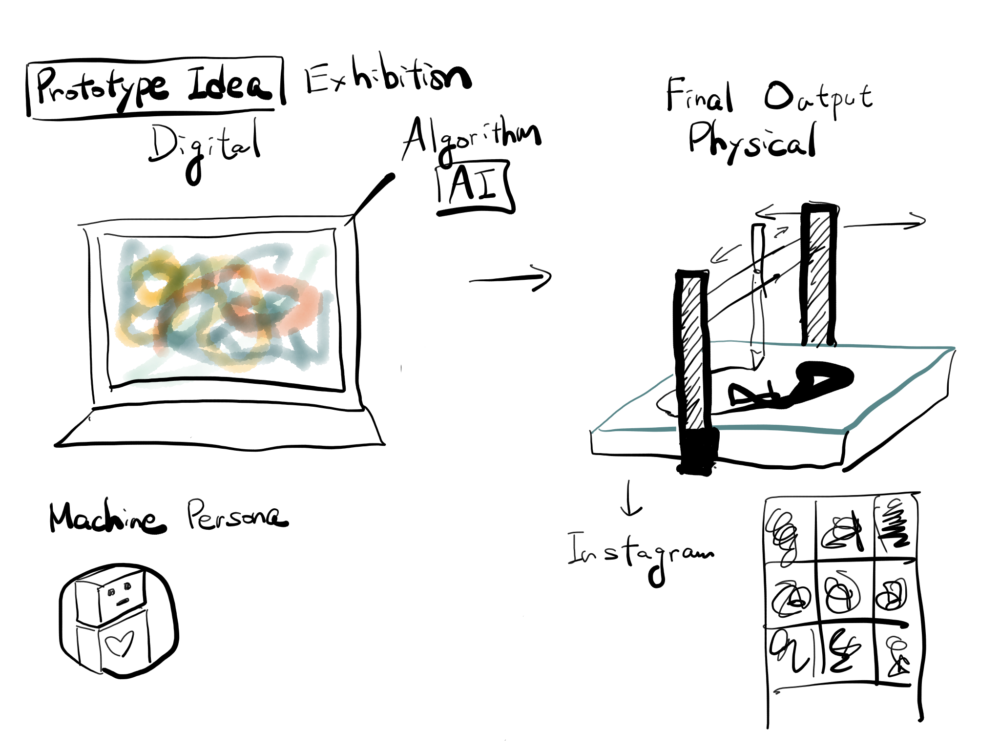
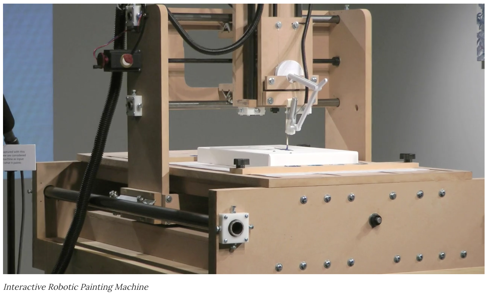
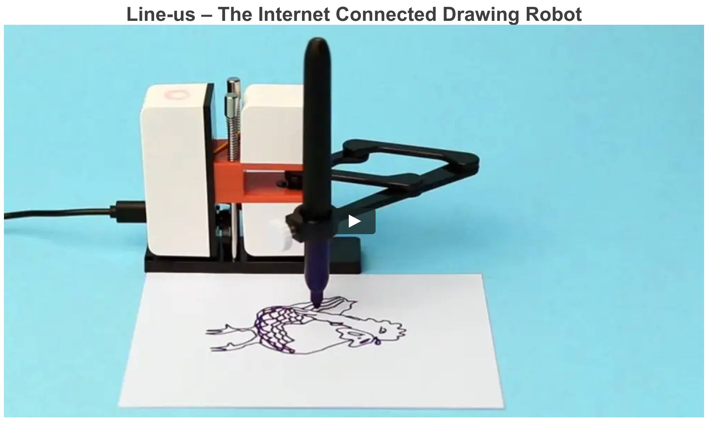

# Current Concept

## Argument
Machines can be Artists.

## Proposal
I will generate a machine individual artist which makes creative outputs from machine unique data

to challenge human centered design and argue existence values of machines.

## Intended form
Creative output of machine Artists

They will be showcased in the exhibition or/and symposium.

## What I will make

- Machine Persona
- Sample outcomes of machine artist

# Outcome Image

# Related Exhibition

Creative AI: The robots that would be painters

https://newatlas.com/creative-ai-algorithmic-art-painting-fool-aaron/36106/

Interactive Robotic Painting Machine　by　Benjamin Grosser

https://vimeo.com/23998286

# Possible Technology / Tools

Artificial Intelligence x Processing (for midterm)

https://www.openprocessing.org/sketch/396674

Line Us: Small pen plotter for prototyping (for final)

https://www.line-us.com/

