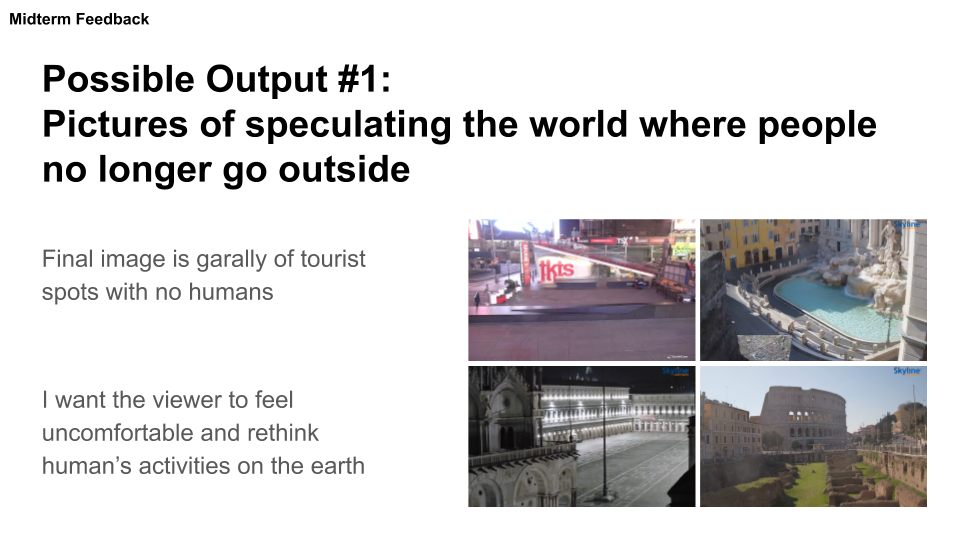

# Current Concept

## Guiding Question under the coronavirus situation
As an extreme extension of the current situation, what does a world where people do not go out look like?

What will people do? Will it be better for the earth?

## Modified Concept
I will create a series of visual artworks speculating the post-coronavirus worldview using Artificial Intelligence to challenge current human-centric worldview and open up possible worlds.

## Final Online Exhibition
I will make pictures of speculating the world where people no longer go outside.

Final image is a gallery of tourist spots with no humans.

I want the viewer to feel uncomfortable and rethink human’s activities on the earth (anthropocene).

# Thinking Process

